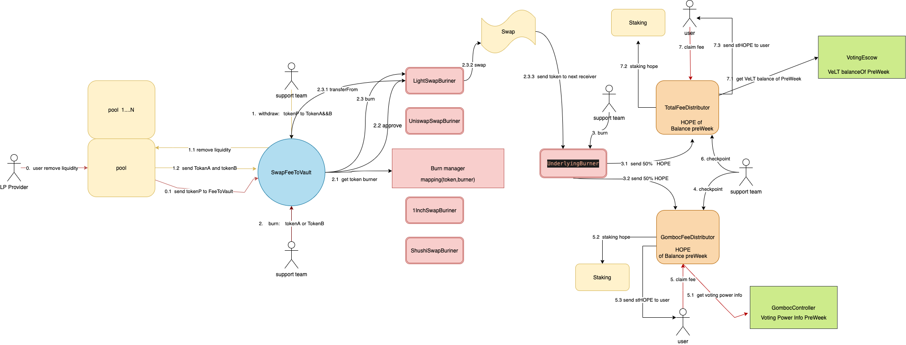

# Light Dao: Fee Collection and Distruibution

Light exchange contracts have the capability to charge an “admin fee”, claimable by the feeToVault. The admin fee is represented as a percentage of the total fee collected on a swap.

For exchanges the fee is taken in the output currency and calculated against the final amount received. For example, if swapping from USDT to USDC, the fee is taken in USDC.


In addition to Swap, the fee generated by other protocols(not released) of Light Dao will also be collected and distribution. 

Admin fee for all protocols of lightDao are indirectly owned by the Light DAO via a feeToVault ownership contract. This contract includes functionality to withdraw the fees, convert them to HOPE, and forward 50% them into the fee distributor contract,and  forward 50% them into the gomboc fee distributor contract. Collectively, this process is referred to as “burning”.

```
The burn process involves multiple transactions and is very gas intensive. Anyone can execute any step of the burn process at any time and there is no hard requirement that it happens in the correct order. However, running the steps out of order can be highly inefficient. If you wish to burn, it is recommended that you review all of the following information so you understand exactly what is happening.
```

## contract relationshop diagram


## Withdrawing Admin Fees

Swap Admin fees(tokenP) are stored within SwapFeeToVault.  Fees are initially claimed via SwapFeeToVault.withdrawMany. This withdraws fees from many pools at once, will remove liquidity and get TokenA and TokenB。

## The Burn Process

Burning is handled on a per-coin basis. The process is initiated by calling the SwapFeeToVault.burn or SwapFeeToVault.burnMany functions. Calling to burn a coin will get burner from burnerManager and  transfers that coin into the burner and then calls the burn function on the burner.

Each burn action typically performs one conversion into HOPE. As an example, here is the sequence of conversions required to burn WETH:
    
 WETH -> USDC -> HOPE


### LightSwapBurner

The burner works by querying swap rates on both routers[] using a path of initial asset  -> HOPE. It then performs the swap on whichever exchange offers a better rate. The received HOPE is sent into the underlying burner.

The owner can change routers via setRouters


### UnderlyingBurner

The underlying burner handles assets that not HOPE and can be directly swapped to HOPE

Once the entire burn process has been completed you must call execute as the final action:

 ```
  function transferHopeToFeeDistributor external whenNotPaused returns (uint256)
 ````

Divide the received HOPE into two parts and transfers it to the fee distributor and the gomboc fee distributor. 

This is the final function to be called in the burn process, after all other steps are completed. Calling this funciton does nothing if the burner has a zero balance of any of HOPE.


## Fee Distribution

Fees are distributed to VeLT holders via the FeeDistributor contract.

Fees are distributed weekly. The porportional amount of fees that each user is to receive is calculated based on their veLT balance relative to the total veLT supply. This amount is calculated at the start of the week. The actual distribution occurs at the end of the week based on the fees that were collected. As such, a user that creates a new vote-lock should expect to receive their first fee payout at the end of the following epoch week.


The available HOPE balance to distribute is tracked via the “token checkpoint”. This is updated at minimum every 24 hours. Fees that are received between the last checkpoint of the previous week and first checkpoint of the new week will be split evenly between the weeks.

```
function checkpointToken() external
```
Updates the token checkpoint.

The token checkpoint tracks the balance of HOPE within the distributor, to determine the amount of fees to distribute in the given week. The checkpoint can be updated at most once every 24 hours. Fees that are received between the last checkpoint of the previous week and first checkpoint of the new week will be split evenly between the weeks.

To ensure full distribution of fees in the current week, the burn process must be completed prior to the last checkpoint within the week.

A token checkpoint is automatically taken during any claim action, if the last checkpoint is more than 24 hours old.

```
function claim(address _addr) external whenNotPaused returns (uint256)
```

Claims fees for an account.
* _addr: The address to claim for. If none is given, defaults to the caller.

Returns the amount of stHOPE received in the claim. the claim will staking HOPE ,received stHOPE and transfer stHOPE to user.

```
function claimMany(address[] memory _receivers) external whenNotPaused returns (uint256)
```
Perform multiple claims in a single call.
* _receivers: An array of address to claim for. Claiming terminates at the first ZERO_ADDRESS.

This is useful to claim for multiple accounts at once, or for making many claims against the same account if that account has performed more than 50 veLT related actions.

## Gomboc Fee Distributor

Fees are distributed to Gomboc via the GombocFeeDistributor contract and are distributed to VeLT that vote for Gomboc.

Fees are distributed weekly. distrition is handled on a per-gomboc basis.
The balance obtained by each gomboc is totalBalancePreWeek * gombocRelativeWeight/1e18. The porportional amount of feesOfGomboc that each user is to receive is calculated based on their vote gomboc to the total  gomboc weight . This amount is calculated at the start of the week. The actual distribution occurs at the end of the week based on the fees that were collected. the gombocRelativeWeight is calculated at the start of the week.

The available HOPE balance to distribute is tracked via the “token checkpoint”. This is updated at minimum every 24 hours. Fees that are received between the last checkpoint of the previous week and first checkpoint of the new week will be split evenly between the weeks.

```
function gombocBalancePreWeek(address _gomboc, uint256 _weekCursor) external view returns (uint256)
```
return the fee of Gomboc for a epoch week. 

A token checkpoint is automatically taken during any claim action, if the last checkpoint is more than 24 hours old.

```
function claim(address gomboc, address _addr) external whenNotPaused returns (uint256) 
```
* gomboc the address of gomboc to claim for
* _addr: The address to claim for. If none is given, defaults to the caller.

Returns the amount of stHOPE received in the claim. the claim will staking HOPE ,received stHOPE and transfer stHOPE to user.

```
function claimMany(address gomboc, address[] memory _receivers) external whenNotPaused returns (uint256)
```
Perform multiple claims in a single call.
* gomboc the address of gomboc to claim for.
* _receivers: An array of address to claim for. Claiming terminates at the first ZERO_ADDRESS.

```
function claimManyGomboc(address[] memory gombocList, address receiver) external whenNotPaused returns (uint256)
```

* gombocList An array of gomboc address to claim for
* receiver: The address to claim for. If none is given, defaults to the caller.

This is useful to claim for multiple gomboc at once..


