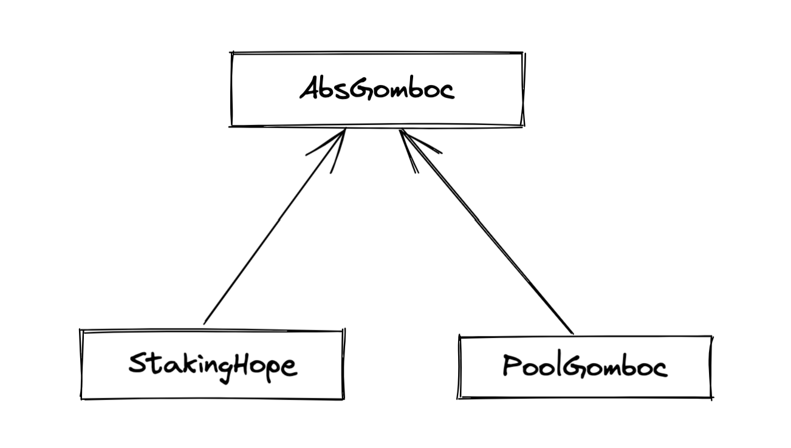

# relationship




# AbsGomboc

> Gomboc abstract contract

###  Querying Gauge Information

```solidity
function lpTotalSupply() public view virtual returns (uint256);
```

>  Requires an inherited class implementation

The total amount of LP tokens that are currently deposited into the Gomboc.


### Querying User Information


```solidity
function lpBalanceOf(address _addr) public view virtual returns (uint256);
```

> Requires an inherited class implementation

The total amount of LP tokens that are currently deposited into the Gomboc.


```solidity
function workingSupply() public view returns(uint256);
```

The “working supply” of the Gomboc - the effective total LP token amount after all deposits have been boosted


```solidity
function integrateFraction(address addr)public view returns(uint256);
```

The total amount of `LT`, both mintable and already minted, that has been allocated to `addr` from this Gomboc.


### Checkpoints

```solidity
function userCheckpoint(address _addr) external returns (bool);
```

Record a checkpoint for `addr`, updating their boost.

Only callable by `addr` or `Minter` - you cannot trigger a checkpoint for another user.


```solidity
function kick(address _addr) external;
```

rigger a checkpoint for `addr`. Only callable when the current boost for `addr` is greater than it should be, due to an expired `veLT` lock.


### Set killing the Gomboc

```solidity
function setKilled(bool _isKilled) external;
```

notice Set the killed status for this contract
* `dev` When killed, the gauge always yields a rate of 0 and so cannot mint `LT`
* param `_isKilled` Killed status to set


# PoolGomboc
> other liquidity providers Gomboc

### Querying Gauge Information

```solidity
function lpToken() external view returns (address);
```

Query the lp token used for this Gomboc


```solidity
function claimableTokens(address _addr) external returns (uint256);
```

The amount of currently mintable `LT` for `addr` from this Gomboc.


### Deposits and Withdrawals

```solidity
function deposit(uint256 _value) external nonReentrant;
function deposit(uint256 _value, address _addr) external nonReentrant;
function deposit(uint256 _value, address _addr, bool _claimRewards_) external nonReentrant;
```

Deposit LP tokens into the Gomboc.

Prior to depositing, ensure that the gauge has been approved to transfer `amount` LP tokens on behalf of the caller.

- `_value`: Amount of tokens to deposit
- `_addr`: Address to deposit for. If not given, defaults to the caller. If specified, the caller must have been previous approved via approved_to_deposit;


```
function withdraw(uint256 _value) external nonReentrant;
function withdraw(uint256 _value, bool _claimRewards_) external nonReentrant;
```

Withdraw LP tokens from the Gomboc.

* `amount`: Amount of tokens to withdraw.


### Approvals and Transfers

```solidity
function transfer(address _to, uint256 _value) external nonReentrant returns (bool);
```

Transfer token for a specified address

Transferring claims pending reward tokens for the sender and receiver

* _to The address to transfer to.
* _value The amount to be transferred


```solidity
function transferFrom(address _from, address _to, uint256 _value) external nonReentrant returns (bool);
```

Transfer tokens from one address to another.

Transferring claims pending reward tokens for the sender and receiver

* `_from` address The address which you want to send tokens from

* `_to` address The address which you want to transfer to

* `_value` uint256 the amount of tokens to be transferred


```solidity
function approve(address _spender, uint256 _value) external returns (bool);
```

Approve the passed address to transfer the specified amount of tokens on behalf of msg.sender

* `_spender` The address which will transfer the funds
* `_value` The amount of tokens that may be transferred


```solidity
function increaseAllowance(address _spender, uint256 _addedValue) external returns (bool);
```

Increase the allowance granted to `_spender` by the caller.

This is alternative to {approve} that can be used as a mitigation for the potential race condition

* `_spender` The address which will transfer the funds
* `_addedValue` The amount of to increase the allowance


```solidity
function decreaseAllowance(address _spender, uint256 _subtractedValue) external returns (bool);
```

Decrease the allowance granted to `_spender` by the caller, This is alternative to {approve} that can be used as a mitigation forthe potential race condition.

* `_spender` The address which will transfer the funds.
* `_subtractedValue` The amount of to decrease the allowance


### Checking and Claiming Rewards


```solidity
function claimRewards() external;
function claimRewards(address _addr) external;
function claimRewards(address _addr, address _receiver) external;
```

Claim all available reward tokens for `_addr`. If no address is given, defaults to the caller. If the `_receiver` argument is provided rewards will be distributed to the address specified (caller must be `_addr` in this case). If the `_receiver` argument is not provided, rewards are sent to the default receiver for the account if one is set.


### Querying Reward Information

```solidity
function rewardsReceiver(address addr) public  view returns(address);
```

This Gomboc implementation allows for the redirection of claimed rewards to alternative accounts. If an account has enabled a default rewards receiver this function will return that default account, otherwise it’ll return `ZERO_ADDRESS`.


### Calculating Claimable Rewards


``` solidity
function claimableReward(address _user, address _reward_token) external view returns (uint256);
```