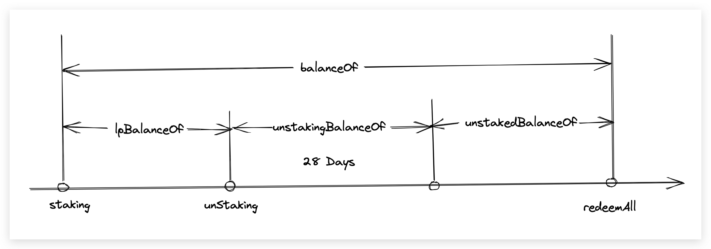

# StakingHope
> First of all, StakingHope is a Gomboc, and stHOPE is obtained by staking HOPE$ in order to obtain LT$ incentives.


# Contract Function



```solidity
 function staking(uint256 amount, uint256 nonce, uint256 deadline, bytes memory signature) external;
```
Stake HOPE$ to get stHOPE$, the conversion ratio is 1:1.


```solidity
function unStaking(uint256 amount) external;
```

unstaking the staked amount.

`Notice`: The unstaking process takes 28 days to complete. During this period, the unstaked $HOPE cannot be traded, and no staking rewards are accrued.


```solidity
function unstakingBalanceOf(address _addr) external view returns (uint256)

```
quiry unstaking amount


```solidity
function unstakedBalanceOf(address _addr) external view returns (uint256)
```

quiry can redeem amounts


```solidity
function redeemAll() external;
```

Redeem all amounts to your account.


```solidity
function transfer(address to, uint256 amount) public virtual override returns (bool);
```

Transfers Gomboc deposit (stHOPE) from the caller to _to.


```solidity
function transferFrom(address from, address to, uint256 amount) public override returns (bool);
```

Tansfers a Gomboc deposit between _from and _to.